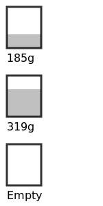

# Dogfood

Calculates the expected weight of a can at the end of the day, if you (or your dog) is eating a fraction of a can each day.

# What?

For example, let's say you eat 2/3rds of a 400g can each day:

```
$ cargo build --release --quiet
$ ./target/release/dogfood 2 3
Starting with a full can...
End of day 1: 1/3 left over, 185g
End of day 2: 2/3 left over, 319g
End of day 3: 0 left over, Empty
```


> New to Rust?  Hello! :wave:
>  
> To get started, install [Rust](https://www.rust-lang.org/tools/install) to get access to `cargo`, which is the Rust build tool.


# Bonus

As a picture:

```
$ ./target/release/dogfood 2 3 --svg two_thirds.svg
$ open -a Firefox two_thirds.svg
```

Like this:



Just gorgeous :tada:
